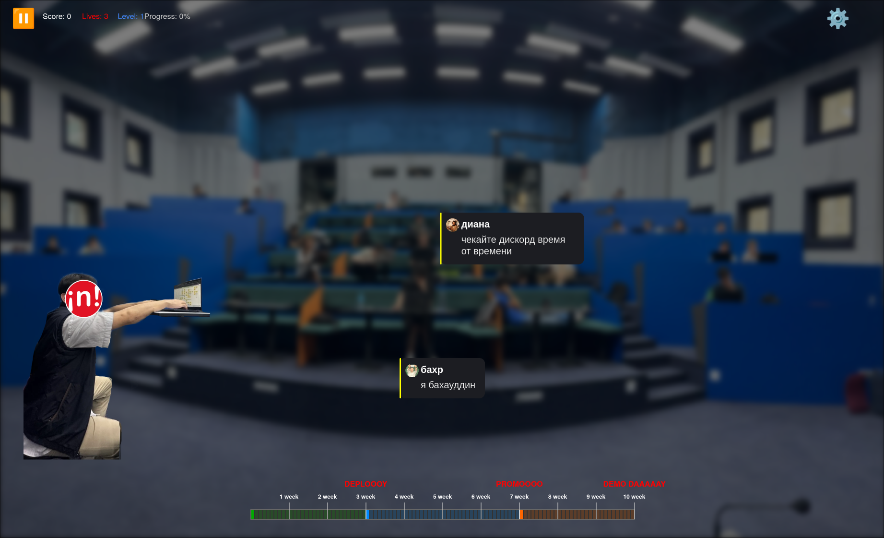

# Typetorial Incubator

🎮 **Hackathon Project for nfactorial Incubator**

Typing game where players shoot letters at flying words to destroy them before they reach the left side of the screen.

## 📸 Screenshot



## 🎯 Game Concept

**Genre:** Educational Typing Game
**Platform:** Web (TypeScript + Canvas)
**Target:** Improve typing speed and accuracy through engaging gameplay

### Core Mechanics:
- Words fly from right to left across the screen
- Player types letters to shoot bullets that destroy matching letters in words
- Complete words disappear and award points
- Unfinished words that reach the left side cause damage
- Game over when all lives are lost

## 🏗️ Project Architecture

```
src/
├── game/
│   ├── core/
│   │   ├── GameEngine.ts      # Main game engine
│   │   ├── InputManager.ts    # Keyboard input handling
│   │   └── ScoreManager.ts    # Score and lives management
│   ├── entities/
│   │   ├── Player.ts          # Player character (left side)
│   │   ├── Monster.ts         # Monster spawner (right side)
│   │   ├── Word.ts           # Flying word entity
│   │   └── Bullet.ts         # Letter bullet projectile
│   ├── systems/
│   │   ├── WordSpawner.ts    # Word generation system
│   │   ├── CollisionSystem.ts # Collision detection
│   │   └── AnimationSystem.ts # Animation controller
│   ├── scenes/
│   │   ├── GameScene.ts      # Main gameplay scene
│   │   └── MenuScene.ts      # Menu and UI screens
│   └── data/
│       └── wordDictionary.ts # Word database
├── ui/
│   ├── components/           # UI components
│   └── styles/              # CSS styles
└── main.ts
```

## 🚀 Tech Stack

**Core Technologies:**
- **TypeScript** - Type-safe JavaScript
- **Canvas API** - 2D rendering
- **Vite** - Fast development build tool

**Optional Libraries:**
- **GSAP** or **Framer Motion** - Smooth animations
- **Howler.js** - Audio effects (typing, hits, errors)

```json
{
  "dependencies": {
    "gsap": "^3.12.2",
    "howler": "^2.2.3"
  },
  "devDependencies": {
    "vite": "^7.0.4",
    "typescript": "~5.8.3",
    "@types/howler": "^2.2.7"
  }
}
```

## 🏆 Hackathon Timeline (24 hours)

### Phase 1: Foundation (Hours 1-6)
- [x] Project setup and structure
- [x] Basic canvas rendering
- [x] Player character and monster sprites
- [x] Keyboard input system

### Phase 2: Core Gameplay (Hours 7-16)
- [ ] Word spawning and movement
- [ ] Letter shooting mechanics
- [ ] Collision detection system
- [ ] Score and lives management

### Phase 3: Polish & Features (Hours 17-22)
- [ ] Animations and visual effects
- [ ] Sound effects and feedback
- [ ] UI/UX improvements
- [ ] Difficulty progression

### Phase 4: Testing & Deployment (Hours 23-24)
- [ ] Bug fixes and optimization
- [ ] Final testing
- [ ] Deployment to GitHub Pages

## 🎮 Game Features

### MVP (Minimum Viable Product):
- ✅ Basic word shooting mechanics
- ✅ Score system
- ✅ Lives/health system
- ✅ Game over state

### Stretch Goals:
- 🎯 Different word categories
- 🎨 Particle effects and animations
- 🔊 Audio feedback
- 📊 Statistics and leaderboard
- 🎪 Multiple difficulty levels

## 🏃‍♂️ Quick Start

```bash
# Install dependencies
npm install

# Start development server
npm run dev

# Build for production
npm run build

# Deploy to GitHub Pages
npm run deploy
```

## 🚀 Deployment

The project is configured for automatic deployment to GitHub Pages.

**Live Demo:** https://yourusername.github.io/typetorial_incubator

### Setup GitHub Pages:
1. Go to Repository Settings → Pages
2. Select "GitHub Actions" as source
3. Update username in `package.json`
4. Push to main branch

## 👥 Team Structure

**Optimal division for hackathon:**

### Developer 1 (Backend Logic):
- Game engine and core systems
- Word management and collision detection
- Input handling and game states

### Developer 2 (Frontend/UI):
- Visual components and animations
- UI/UX design and styling
- Audio integration and effects

## 🎯 Key Implementation Points

1. **Efficient Rendering** - Canvas-based 2D graphics
2. **Responsive Input** - Real-time keyboard handling
3. **Smooth Animations** - 60fps gameplay experience
4. **Scalable Architecture** - Easy to extend and modify

## 🏅 nfactorial Incubator

This project is developed as part of the nfactorial Incubator hackathon, focusing on:
- Rapid prototyping skills
- Team collaboration
- Technical implementation
- User experience design

---

**Built with ❤️ during nfactorial Incubator Hackathon**
